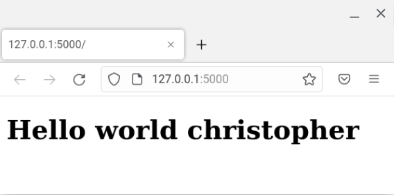
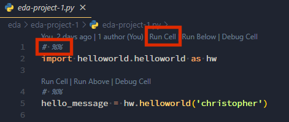
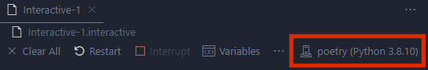
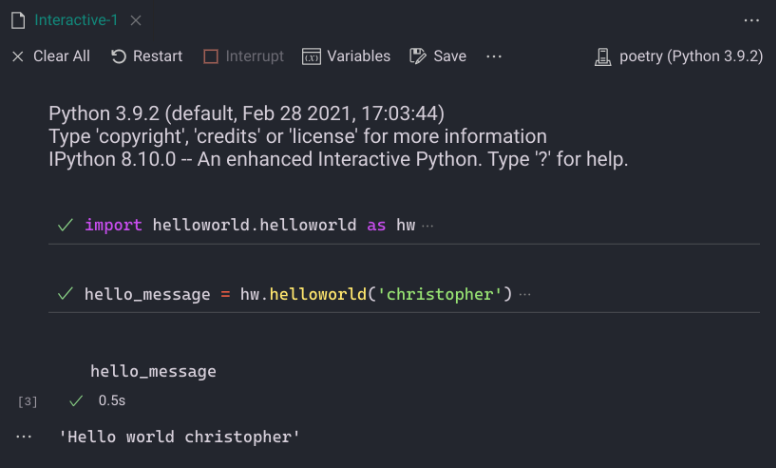
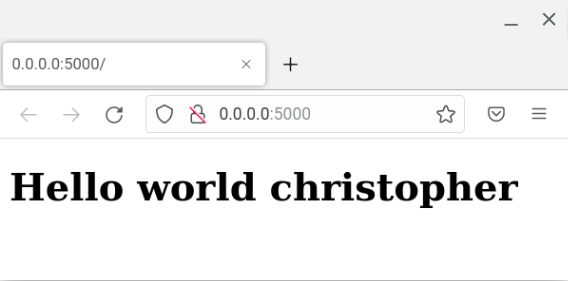

# Mono repo with Python Poetry

What we are looking to do is create a code repository that can be used as the source for many Python applications (Flask deployed with Docker) and exploratory data analysis that can share a common library of functions.
Pretty much all the credit for this comes from the following article, where Dan Hipschman goes through the process that Opendoor went through to create a mono repo.

[Source](https://medium.com/opendoor-labs/our-python-monorepo-d34028f2b6fa)

```txt
📁ml
├── 📁app  # Each application has a directory here
│   ├── 📁<project/program> # name of project or program within mono repo
│   │   ├── 📁flask-app-1
│   │   │   ├── app.py  # Each application has an app entry point
│   │   │   ├── Dockerfile  # Each application has a Dockerfile
│   │   │   ├── pyproject.toml  # Each eda project has its own dependencies
│   │   └── 📁flask-app-2 ...
├── 📁docs # Documentation as a series of markdown files
│   ├── README.md
├── 📁eda  # Each exploratory data analysis task has a directory here
│   ├── 📁<project/program> # name of project or program within mono repo
│   │   ├── 📁eda-project-1
│   │   │   ├── eda-project-1.py  # Each eda project has Python scripts
│   │   │   ├── pyproject.toml  # Each eda project has its own dependencies
│   │   └── 📁eda-project-2 ...
├── 📁eng  # Each data engineering task including sourcing and curation
│   ├── 📁<project/program> # name of project or program within mono repo
│   │   ├── 📁eng-task-1
│   │   │   ├── eda-project-1.py  # Each eda project has Python scripts
│   │   │   ├── pyproject.toml  # Each eda project has its own dependencies
│   │   └── 📁eng-task-2 ...
├── 📁infra  # Infrastructure managed by IaC solution (Terraform in this case)
│   ├── 📁tf
│   │   ├── 📁<cloud-provider>/
│   │   │   ├── main.tf  # Separate Terraform module files
├── 📁lib  # Each lib is a Python package that you can install using poetry (or pip)
│   ├── 📁helloworld  #
│   │   ├── 📁helloworld/
│   │   │   ├── __init__.py
│   │   │   ├── helloworld.py
│   │   └── 📁tests/
│   │   │   ├── test_helloworld.py
│   │   ├── pyproject.toml  # Each lib specifies its dependencies
│   └── 📁lib-2 ...
├── 📁model  # Infrastructure managed by IaC solution (Terraform in this case)
│   ├── 📁<project/program> # name of project or program within mono repo
│   │   ├── 📁<model>
│   │   │   ├── 📁<package>
│   │   │   ├── 📁<train-image>
│   │   │   ├── 📁<predict-image>
└── 📁tools
    ├── 📁build  # Application build script
```

For this, I have tested on both ChromeOS Linux (Debian) and Windows WSL2 (Ubuntu 20.04).
Docs from here are from the WSL2 run through.

## Fresh Python Virtual Environment (venv)

```sh
# Make new directory in your home for virtual environments
mkdir ~/venv
# change into directory
cd ~/venv
# create a virtual environment named poetry (or any other name you choose)
python3 -m venv poetry
# activate the vitrual environment
source poetry/bin/activate
# confirm it activated
which python3
```

Clone this Git repo

```sh
# Make new directory in your home for git repos
mkdir ~/git
# change into directory
cd ~/git
# clone the repository
git clone https://github.com/mortie23/ml.git
# change into the clone repo
cd ml
```

## Getting started with Poetry

Install this repositories requirements (which is just poetry). The remaining packages poetry will handle.

```sh
pip install -r requirements.txt
```

## Using Poetry to install Python packages

Now using poetry to install the packages (including the internal one)

```sh
cd app/flask-app-1
poetry lock && poetry install
```

```log
Updating dependencies
Resolving dependencies... (1.8s)

Writing lock file
Installing dependencies from lock file

Package operations: 12 installs, 2 updates, 0 removals

  • Installing markupsafe (2.1.2)
  • Installing click (8.1.3)
  • Installing exceptiongroup (1.1.0)
  • Updating importlib-metadata (4.13.0 -> 6.0.0)
  • Installing iniconfig (2.0.0)
  • Installing itsdangerous (2.1.2)
  • Installing jinja2 (3.1.2)
  • Installing pluggy (1.0.0)
  • Updating setuptools (44.0.0 -> 67.3.2)
  • Installing werkzeug (2.2.3)
  • Installing flask (2.2.3)
  • Installing gunicorn (20.1.0)
  • Installing pytest (7.2.1)
  • Installing helloworld (0.1.0 /mnt/c/git/github/mortie23/ml/lib/helloworld)
```

Run the app with poetry. This app sources from the internal package in dev mode, so changes made to the source files are reflected as they change.

```sh
# use poetry to run the app with the venv python3 binary
poetry run python3 app.py
```

```sh
 * Serving Flask app 'app'
 * Debug mode: off
WARNING: This is a development server. Do not use it in a production deployment. Use a production WSGI server instead.
 * Running on http://127.0.0.1:5000
Press CTRL+C to quit
127.0.0.1 - - [15/Feb/2023 19:33:46] "GET / HTTP/1.1" 200 -
```



## Testing internal package for EDA

```sh
cd ../../eda/eda-project-1/
poetry lock && poetry install
```

```log
Updating dependencies
Resolving dependencies... (8.2s)

Writing lock file
Installing dependencies from lock file

Package operations: 25 installs, 1 update, 0 removals

  • Installing asttokens (2.2.1)
  • Installing executing (1.2.0)
  • Installing parso (0.8.3)
  • Updating platformdirs (2.6.2 -> 3.0.0)
  • Installing pure-eval (0.2.2)
  • Installing traitlets (5.9.0)
  • Installing wcwidth (0.2.6)
  • Installing backcall (0.2.0)
  • Installing decorator (5.1.1)
  • Installing jedi (0.18.2)
  • Installing jupyter-core (5.2.0)
  • Installing matplotlib-inline (0.1.6)
  • Installing pickleshare (0.7.5)
  • Installing prompt-toolkit (3.0.36)
  • Installing pygments (2.14.0)
  • Installing python-dateutil (2.8.2)
  • Installing pyzmq (25.0.0)
  • Installing stack-data (0.6.2)
  • Installing tornado (6.2)
  • Installing comm (0.1.2)
  • Installing debugpy (1.6.6)
  • Installing ipython (8.10.0)
  • Installing jupyter-client (8.0.3)
  • Installing nest-asyncio (1.5.6)
  • Installing psutil (5.9.4)
  • Installing ipykernel (6.21.2)
```

Register the ipykernel

```sh
python3 -m ipykernel install --user --name=poetry
```

Now to test running the EDA code within VScode, you need to have installed the VSCode Python extension from Microsoft.
This will activate the **Run Cell** links above each of the `# %%` comment blocks.



When you do, an interactive windows will open the right side. Since you have registered your ipykernel, you will need to select it.



Now, when you run the cells, you should see that the internal package can be successfully run from the EDA project code.



## Internal package unit testing

To test each function in the internal package we have included pytest and an example unit test.

```sh
cd lib/helloworld
pytest
```

```log
=================================== test session starts ====================================
platform linux -- Python 3.8.10, pytest-7.2.1, pluggy-1.0.0
rootdir: /mnt/c/git/github/mortie23/ml/lib/helloworld
collected 1 item

tests/test_helloworld.py .                                                           [100%]

==================================== 1 passed in 0.09s =====================================
```

## Internal package dependency

Since we are using poetry to manage the internal package as a dependency in the mono repo, it works in development mode on own local client machine, however when deploying the application using a Docker container, it will not have access to the internal package.

We can either:

- deploy the package to an internal package server and then update the `pyproject.toml` file to source from the internal package server
- copy the internal package from the lib directory it is currently in within the mono repo temporarily for the building of the docker image

- There are probably other options, but the simplest option for me for this small example was the second option. the build step does this.

## Build the docker container

If also testing this on Windows WSL2, you will need to install Docker desktop for windows and then configure it to use WSL2 as the kernel.

```sh
cd tools/build/
chmod +x build.sh
./build.sh flask-app-1
```

```log
flask-app-1
sending incremental file list

sent 630 bytes  received 17 bytes  1,294.00 bytes/sec
total size is 2,597  speedup is 4.01
[+] Building 10.3s (12/12) FINISHED
 => [internal] load build definition from Dockerfile                                    0.1s
 => => transferring dockerfile: 436B                                                    0.0s
 => [internal] load .dockerignore                                                       0.0s
 => => transferring context: 2B                                                         0.0s
 => [internal] load metadata for docker.io/library/python:3.8-buster                    2.9s
 => [auth] library/python:pull token for registry-1.docker.io                           0.0s
 => [1/7] FROM docker.io/library/python:3.8-buster@sha256:<>                            0.0s
 => [internal] load build context                                                       0.1s
 => => transferring context: 24.27kB                                                    0.1s
 => CACHED [2/7] RUN pip install "poetry==1.3.2"                                        0.0s
 => [3/7] COPY poetry.lock pyproject.toml app.py /                                      0.1s
 => [4/7] COPY lib lib/                                                                 0.1s
 => [5/7] COPY templates templates/                                                     0.0s
 => [6/7] RUN poetry config virtualenvs.create false   && poetry install --no-dev       6.6s
 => exporting to image                                                                  0.2s
 => => exporting layers                                                                 0.2s
 => => writing image sha256:<>                                                          0.0s
 => => naming to docker.io/mortimerxyz/flaskapp1:0.0.1                                  0.0s
```

## Run the docker container

```sh
docker run -p 5000:5000 mortimerxyz/flaskapp1:0.0.1
```

```log
[2023-02-15 08:59:29 +0000] [1] [INFO] Starting gunicorn 20.1.0
[2023-02-15 08:59:29 +0000] [1] [INFO] Listening at: http://0.0.0.0:5000 (1)
[2023-02-15 08:59:29 +0000] [1] [INFO] Using worker: sync
[2023-02-15 08:59:29 +0000] [8] [INFO] Booting worker with pid: 8
```


