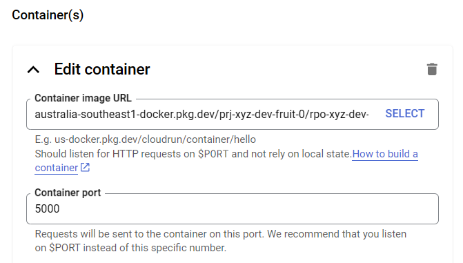

# Hello Fruit

A simple example of a Flask application that uses a function from a shared Python module.

## Setup

```sh
# Change to the root of the application
cd app/flask-hellofruit/
# Install application dependencies using poetry
poetry install
```

## Running the application

```sh
poetry run flask run
```

```log
 * Debug mode: off
WARNING: This is a development server. Do not use it in a production deployment. Use a production WSGI server instead.
 * Running on http://127.0.0.1:5000
Press CTRL+C to quit
127.0.0.1 - - [17/Jul/2024 21:03:36] "GET / HTTP/1.1" 200 -
127.0.0.1 - - [17/Jul/2024 21:03:36] "GET /favicon.ico HTTP/1.1" 404 -
```


## Hosting on GCP with Cloud Run

### Build a Docker container image

We need the Docker build process to have access to the Artifact registry repository. For this we create a service account and associated key file that can be temporarily copied during the Docker build process.

```sh
# Create a service account
gcloud iam service-accounts create gsvc-xyz-dev-fruit-rpo --display-name "Artifact Registry Service Account"
# Give service account permissions to artifact registry in project
gcloud projects add-iam-policy-binding prj-xyz-dev-fruit-0 --member=serviceAccount:gsvc-xyz-dev-fruit-rpo@prj-xyz-dev-fruit-0.iam.gserviceaccount.com --role=roles/artifactregistry.reader
# Create application keys JSON file for service account
gcloud iam service-accounts keys create gsvc-xyz-dev-fruit-rpo.json --iam-account gsvc-xyz-dev-fruit-rpo@prj-xyz-dev-fruit-0.iam.gserviceaccount.com
```

Put the JSON keys file in this location on your developer client machine `~\.config\gcloud\gsvc-xyz-dev-fruit-rpo.json`.
In this case it is the home path on the WSL2 Windows client laptop.
It will be used later in the `hellofruit` app Docker build step [Hello Fruit](../app/hellofruit/docs/README.md).

Now we can build the container image.

```sh
docker build . --build-arg SA_KEY_BASE64=`base64 -w0 ~/.config/gcloud/gsvc-xyz-dev-fruit-rpo.json` -t australia-southeast1-docker.pkg.dev/prj-xyz-dev-fruit-0/rpo-xyz-dev-fruit-dkr-0/app/hellofruit:0.1
```

Run the container locally.

```sh
docker run -p 5000:5000 australia-southeast1-docker.pkg.dev/prj-xyz-dev-fruit-0/rpo-xyz-dev-fruit-dkr-0/app/hellofruit:0.1
```

```log
[2024-07-17 11:34:23 +0000] [1] [INFO] Starting gunicorn 22.0.0
[2024-07-17 11:34:23 +0000] [1] [INFO] Listening at: http://0.0.0.0:5000 (1)
[2024-07-17 11:34:23 +0000] [1] [INFO] Using worker: gthread
[2024-07-17 11:34:23 +0000] [7] [INFO] Booting worker with pid: 7
[2024-07-17 11:34:23 +0000] [8] [INFO] Booting worker with pid: 8
```

Push to the Docker registry

```sh
# First auth to the docker artifact registry
gcloud auth configure-docker australia-southeast1-docker.pkg.dev
# Push the local image to the artifact registry
docker push australia-southeast1-docker.pkg.dev/prj-xyz-dev-fruit-0/rpo-xyz-dev-fruit-dkr-0/app/hellofruit:0.1
```


### Cloud Run the service

Using the GCP web console, it is simple to select the container from the Artifact Registry and set the Container port to 5000. The remaining setting are left default settings.



Once the Cloud Run service has completed, you should see the service running and be given a URL to access the service.


