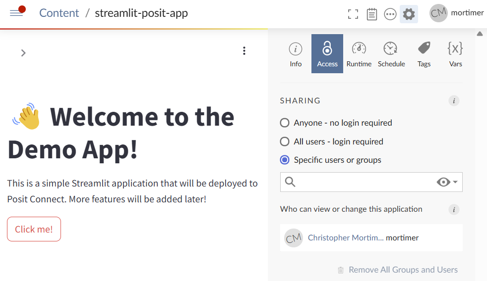

# Python applications published to Posit Connect

This is a simple Streamlit application structured as a modular project and managed using Poetry. The application is designed to be deployed to a Posit Connect server.
Reference:

- [https://github.com/streamlit/demo-face-gan/blob/master/streamlit_app.py](https://github.com/streamlit/demo-face-gan/blob/master/streamlit_app.py)
- [https://bookdown.org/**docs**/user/streamlit/](https://bookdown.org/__docs__/user/streamlit/)

## Project Structure

```
📁streamlit-posit-app
├── 📁streamlit_posit_app
│   └── 📁pages
│       └── __init__.py
│   │   └── home.py
├── 📁tests
│   └── __init__.py
├── app.py
├── .gitignore
├── pyproject.toml
└── README.md
```

## Configure Python applications on Posit Connect

Recommended installation of Python

https://docs.posit.co/resources/install-python.html

```sh
export PYTHON_VERSION="3.12.4"
curl -O https://cdn.rstudio.com/python/ubuntu-2404/pkgs/python-${PYTHON_VERSION}_1_amd64.deb
sudo apt-get update
sudo apt-get install ./python-${PYTHON_VERSION}_1_amd64.deb

# check install
/opt/python/"${PYTHON_VERSION}"/bin/python --version
```

https://docs.posit.co/connect/admin/python/

```ini
; /etc/rstudio-connect/rstudio-connect.gcfg
[Python]
Enabled = true
Executable = /opt/python/3.12.4/bin/python3
```

## Local

Setup our local development environment (WSL2 on Dell XPS Windows 11)

```sh
python3 -m venv ~/venv/posit
source ~/venv/posit/bin/activate
pip install poetry
```

All packages will be managed by poetry. We created this EDA directory with:

```sh
poetry new ./posit-connect-python
```

Then add a package with

```sh
poetry add rsconnect-python
```

But we do not do this manually if restoring from this repo:

```sh
poetry lock && poetry install --no-root
```

## Running the App

To run the Streamlit application locally, use the following command:

```sh
poetry run streamlit run app.py
# or just
streamlit run app.py
```

### Deployment

To deploy the app to a Posit Connect server, ensure you have the `rsconnect-python` package listed in your `requirements.txt`. Use the following command to deploy:

```sh
# Adding server and api key for use later via name
rsconnect add --name vm --server http://192.168.110.133:3939 --api-key <api-key>
# Deploy
rsconnect deploy streamlit --name vm --entrypoint app.py .
```



```log
    Warning: Capturing the environment using 'pip freeze'.
             Consider creating a requirements.txt file instead.
Validating server...    [OK]
Validating app mode...  [OK]
Making bundle ...       [OK]
Deploying bundle ...    [OK]
Saving deployed information...  [OK]
Building Streamlit application...
Bundle created with Python version 3.12.4 is compatible with environment Local with Python version 3.12.4 from /opt/python/3.12.4/bin/python3.12
Bundle requested Python version 3.12.4; using /opt/python/3.12.4/bin/python3.12 from Local which has version 3.12.4
2025/04/09 11:20:54.466483344 [rsc-session] Content GUID: a90a5b19-d989-4cf1-99fd-7fa748fadae4
2025/04/09 11:20:54.467263345 [rsc-session] Content ID: 6
2025/04/09 11:20:54.467448246 [rsc-session] Bundle ID: 10
2025/04/09 11:20:54.467591546 [rsc-session] Job Key: CXzbEAP0fl5PEUf6
Determining session server location ...
Connecting to session server http://127.0.0.1:35199 ...
Connected to session server http://127.0.0.1:35199
2025/04/09 11:20:55.567199857 Running on host: ubuntu-2404-server
2025/04/09 11:20:55.613260740 Linux distribution: Ubuntu 24.04.2 LTS (noble)
2025/04/09 11:20:55.633468077 Running as user: uid=996(rstudio-connect) gid=987(rstudio-connect) groups=987(rstudio-connect)
2025/04/09 11:20:55.633742877 Connect version: 2024.09.0
2025/04/09 11:20:55.634468878 LANG: en_US.UTF-8
2025/04/09 11:20:55.634618579 Working directory: /opt/rstudio-connect/mnt/app
2025/04/09 11:20:55.635216580 Building environment using Python 3.12.4 (main, Feb 25 2025, 22:32:47) [GCC 13.3.0] at /opt/python/3.12.4/bin/python3.12
2025/04/09 11:20:55.647333402 Using cached environment: Bq5M9EoyWyCJi_KEsAiGSg
2025/04/09 11:20:58.194650391 Packages in the environment: altair==5.5.0, anyio==4.9.0, asttokens==3.0.0, attrs==25.3.0, blinker==1.9.0, build==1.2.2.post1, CacheControl==0.14.2, cachetools==5.5.2, certifi==2025.1.31, cffi==1.17.1, charset-normalizer==3.4.1, cleo==2.1.0, click==8.1.8, comm==0.2.2, crashtest==0.4.1, cryptography==44.0.2, debugpy==1.8.13, decorator==5.2.1, distlib==0.3.9, dulwich==0.22.8, executing==2.2.0, fastjsonschema==2.21.1, filelock==3.18.0, findpython==0.6.3, gitdb==4.0.12, GitPython==3.1.44, h11==0.14.0, httpcore==1.0.7, httpx==0.28.1, idna==3.10, installer==0.7.0, ipykernel==6.29.5, ipython==9.1.0, ipython_pygments_lexers==1.1.1, jaraco.classes==3.4.0, jaraco.context==6.0.1, jaraco.functools==4.1.0, jedi==0.19.2, jeepney==0.9.0, Jinja2==3.1.6, jsonschema==4.23.0, jsonschema-specifications==2024.10.1, jupyter_client==8.6.3, jupyter_core==5.7.2, keyring==25.6.0, MarkupSafe==3.0.2, matplotlib-inline==0.1.7, more-itertools==10.6.0, msgpack==1.1.0, narwhals==1.34.0, nest-asyncio==1.6.0, num
py==2.2.4, packaging==24.2, pandas==2.2.3, parso==0.8.4, pbs-installer==2025.3.17, pexpect==4.9.0, pillow==11.1.0, pkginfo==1.12.1.2, platformdirs==4.3.7, poetry==2.1.2, poetry-core==2.1.2, prompt_toolkit==3.0.50, protobuf==5.29.4, psutil==7.0.0, ptyprocess==0.7.0, pure_eval==0.2.3, pyarrow==19.0.1, pycparser==2.22, pydeck==0.9.1, Pygments==2.19.1, PyJWT==2.10.1, pyproject_hooks==1.2.0, python-dateutil==2.9.0.post0, pytz==2025.2, pyzmq==26.4.0, RapidFuzz==3.13.0, referencing==0.36.2, requests==2.32.3, requests-toolbelt==1.0.0, rpds-py==0.24.0, SecretStorage==3.3.3, semver==3.0.4, setuptools==78.1.0, shellingham==1.5.4, six==1.17.0, smmap==5.0.2, sniffio==1.3.1, stack-data==0.6.3, streamlit==1.44.1, tenacity==9.1.2, toml==0.10.2, tomlkit==0.13.2, tornado==6.4.2, traitlets==5.14.3, trove-classifiers==2025.3.19.19, typing_extensions==4.13.1, tzdata==2025.2, urllib3==2.3.0, virtualenv==20.30.0, watchdog==6.0.0, wcwidth==0.2.13, wheel==0.46.1, zstandard==0.23.0,
2025/04/09 11:20:58.195191592 Creating lockfile: python/requirements.txt.lock
Stopped session pings to http://127.0.0.1:35199
Completed Python build using Local against Python version: '3.12.4'
Launching Streamlit application...
Deployment completed successfully.
         Dashboard content URL: http://192.168.110.133:3939/connect/#/apps/a90a5b19-d989-4cf1-99fd-7fa748fadae4/access
         Direct content URL: http://192.168.110.133:3939/content/a90a5b19-d989-4cf1-99fd-7fa748fadae4/
Verifying deployed content...   [OK]
```
