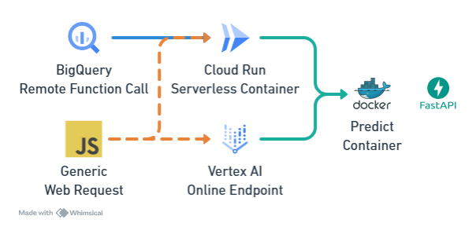
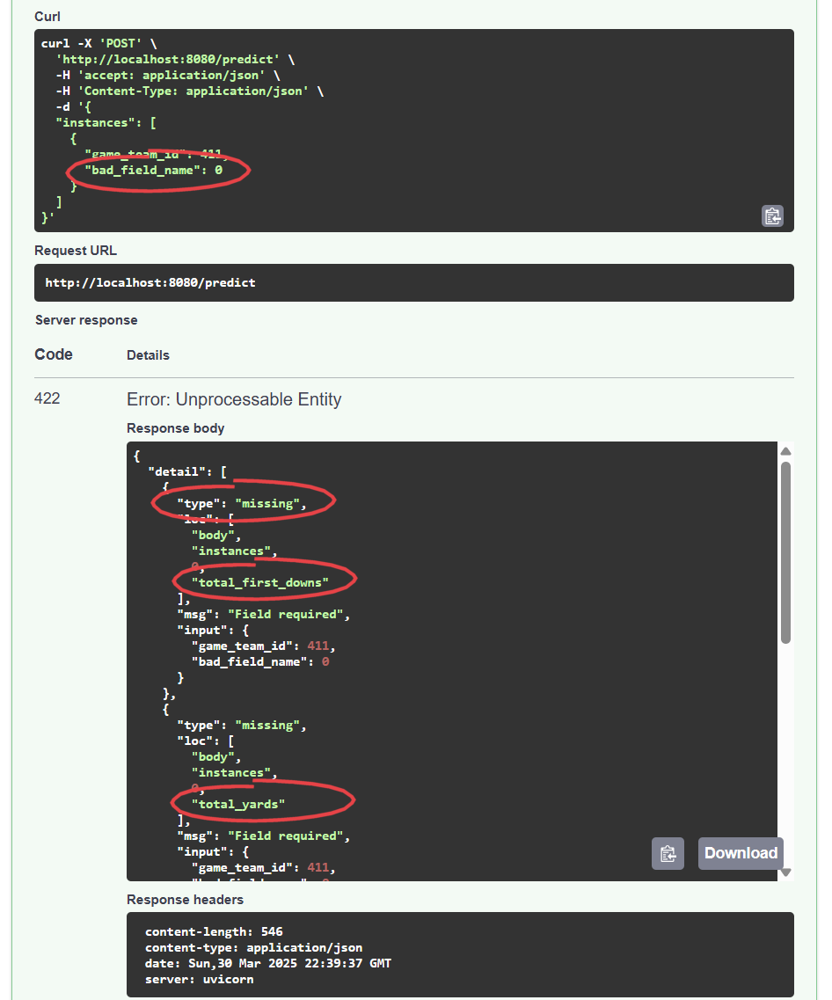
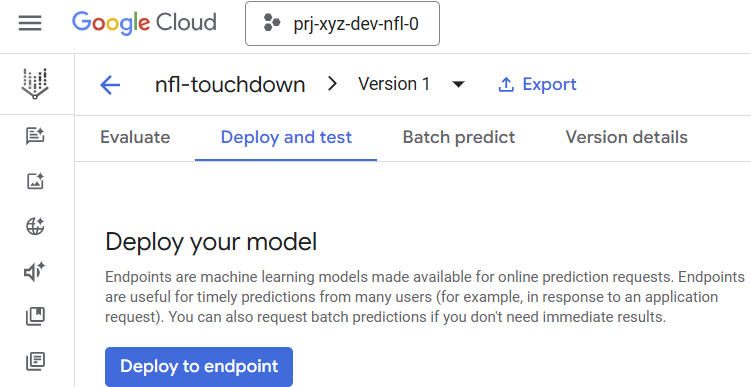
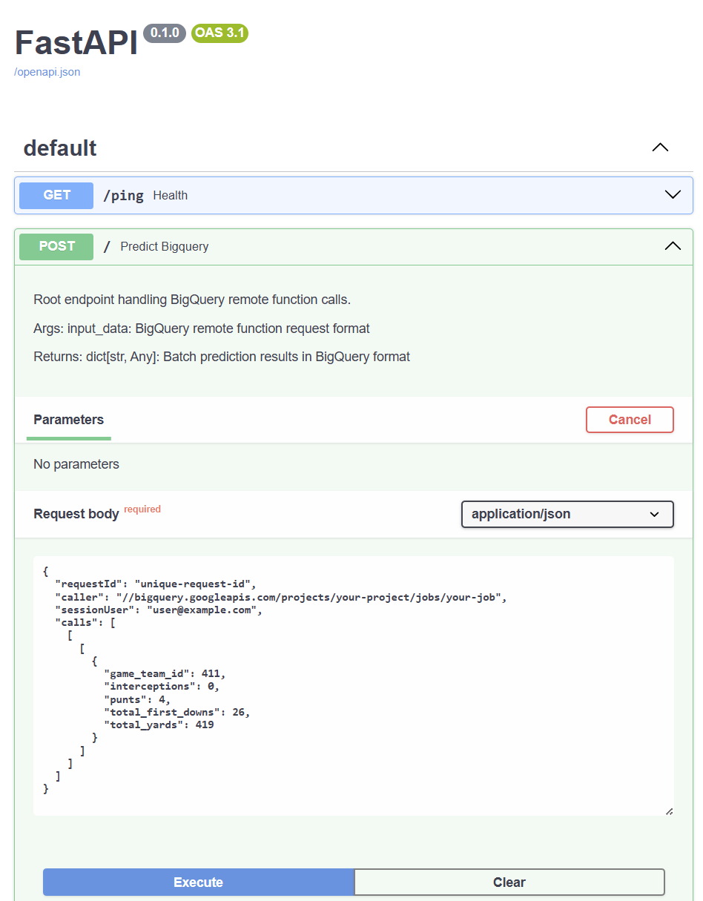
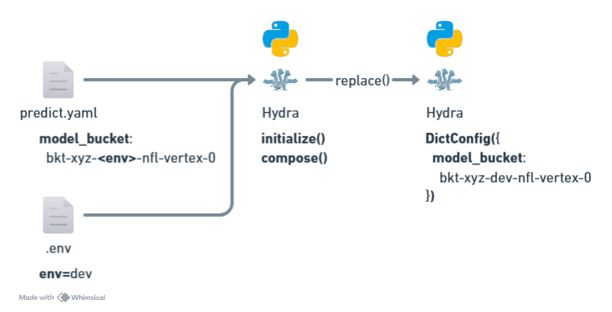

# The Tale of Two Routes: A Love Story Between BigQuery and Vertex AI

Ever tried to make two different services happy with the same ML model? It's like trying to serve breakfast to both an early bird and a night owl - they want the same food but at different times and in different ways! Let me tell you about our adventure with FastAPI, where we made BigQuery and Vertex AI play nice together.

## The Characters in Our Story

First, meet our cast:

- **FastAPI**: The lightning-fast matchmaker
- **Pydantic**: The strict but fair bouncer checking IDs at the door
- **Vertex AI**: The enterprise consultant who loves formal meetings at `/predict`
- **BigQuery**: The data analyst who prefers casual catch-ups at the root path `/`



## The Plot Thickens: Two Routes, One Model

```python
class ModelInputItem(BaseModel):
    game_team_id: int = Field(..., example=411)
    total_first_downs: int = Field(..., example=26)
    total_yards: int = Field(..., example=419)
    interceptions: int = Field(..., example=0)
    punts: int = Field(..., example=4)
```

This is our bouncer's checklist - Pydantic making sure everyone's properly dressed for the party. It's like a strict dress code, but instead of "no sneakers," it's "no string where an integer should be"!



## The Tale of Two Requests

### Vertex AI: The Formal One

```json
{
  "instances": [
    {
      "game_team_id": 411,
      "total_first_downs": 26,
      "total_yards": 419,
      "interceptions": 0,
      "punts": 4
    }
  ]
}
```

Vertex AI shows up being very particular about hosting at `/predict` wearing a three-piece suit, wrapping everything in an "instances" array. Very formal, very proper.



### BigQuery: The Chatty One

```json
{
  "requestId": "unique-request-id",
  "caller": "//bigquery.googleapis.com/projects/...",
  "sessionUser": "user@example.com",
  "calls": [
    [
      [
        {
          "game_team_id": 411,
          "total_first_downs": 26,
          "total_yards": 419,
          "interceptions": 0,
          "punts": 4
        }
      ]
    ]
  ]
}
```

BigQuery comes to `/` with its life story - who it is, where it's from, and oh by the way, here's the actual data nested three levels deep because... why not? 🤷‍♂️



## The Magic of FastAPI Routes

```python
@app.post("/")
async def predict_bigquery(input_data: BigQueryRemoteRequest):
    # BigQuery's casual coffee chat
    # ...existing code...

@app.post(os.environ["AIP_PREDICT_ROUTE"])
async def predict_vertex(input_data: VertexPredictionRequest):
    # Vertex AI's formal business meeting
    # ...existing code...
```

It's like having two different entrances to the same restaurant - the formal dining room for Vertex AI and the casual café for BigQuery. Same kitchen (our ML model), different serving styles!

## The Setup: Environment Magic and Config Sorcery

Before our restaurant even opens its doors, we need to set up the kitchen! Let's peek behind the curtain:

### The .env Chef's Secret Recipe

```ini
env=dev
project_id=prj-xyz-dev-nfl-0
```

It's like having a secret recipe card - keeping our environment spices separate from the main cookbook! 🌶️

### Hydra: The Configuration Sous Chef

```yaml
model_bucket: bkt-xyz-<env>-nfl-vertex-0
model_path: nfl-touchdown/model.joblib
```

Hydra is our sous chef who knows how to adapt the recipe for different kitchens (environments). Watch the magic:

```py
initialize(version_base=None, config_path=".")
cfg = compose(config_name="predict")

# Season the config with environment flavoring
for k, v in cfg.items():
    cfg[k] = v.replace("<env>", env)
```



## The Model: From Training Kitchen to Serving Station

Remember that Vertex AI training job that created our model? It's like a master chef preparing components in the main kitchen. Now we need to get that perfectly trained model to our serving station:

```py
with open("model.joblib", "wb") as model_f:
    client.download_blob_to_file(
        f"{os.environ['AIP_STORAGE_URI']}/model.joblib", model_f
    )

_model = joblib.load("model.joblib")
```

This is like getting our special sauce from the central kitchen (Cloud Storage) where the training job left it. The `AIP_STORAGE_URI` environment variable is our delivery instructions, courtesy of Vertex AI! 🚚

Think of it as a relay race:

1. Training Job: "I've created this perfect model! Storing it in GCS!" 🏃‍♀️
2. Cloud Run Service: "Got the location from `AIP_STORAGE_URI`!" 🏃‍♂️
3. Model Loading: "Model loaded and ready to make predictions!" 🎯

### The Full Kitchen Setup

```python
# Get our environment settings
env_path = Path(__file__).parent.parent / ".env"
load_dotenv(env_path)
env = os.getenv("env")

# Set up our prediction server
app = FastAPI()
client = storage.Client(os.environ["project_id"])

# Download our pre-trained model
with open("model.joblib", "wb") as model_f:
    client.download_blob_to_file(
        f"{os.environ['AIP_STORAGE_URI']}/model.joblib",
        model_f
    )
```

It's like setting up a restaurant where:

- `.env` is our business license 📄
- Hydra config is our recipe book 📚
- The model file is our secret sauce 🥫
- FastAPI is our efficient wait staff 🏃‍♀️

## The Happy Ending

Thanks to FastAPI and Pydantic, we've created a ML model serving solution that's like a restaurant that makes both fine diners and casual brunchers feel at home. The model happily predicts NFL touchdowns while BigQuery and Vertex AI both think they're getting special treatment!


Remember folks, in the end, it's not about the route you take, it's about the predictions you make along the way. 🏈✨

### P.S.

Remember, a good ML service is like a well-run restaurant - the customers don't need to know about the complex kitchen operations, they just enjoy the consistent, delicious predictions! 🎯🍽️
