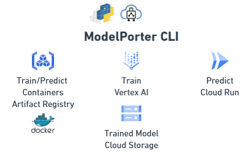
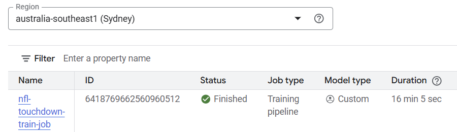
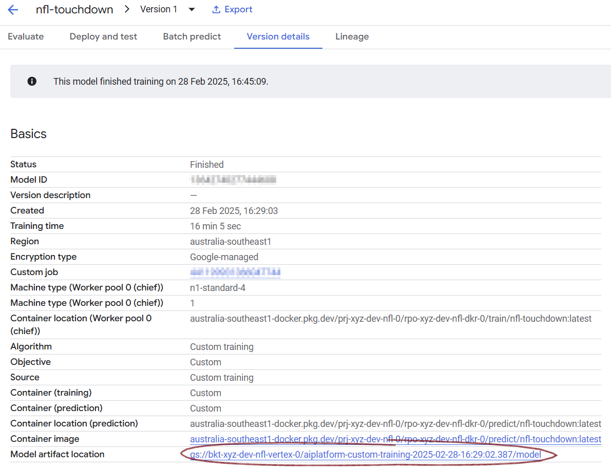
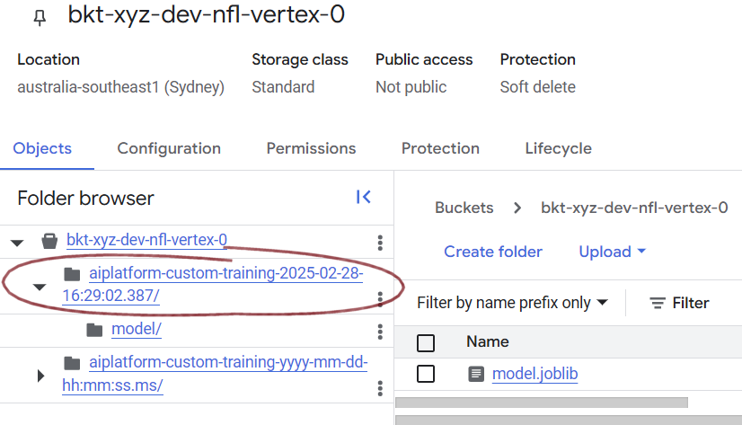
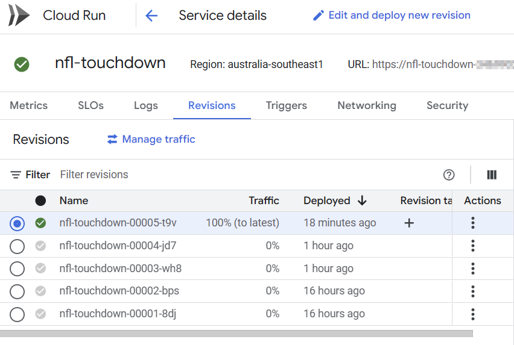
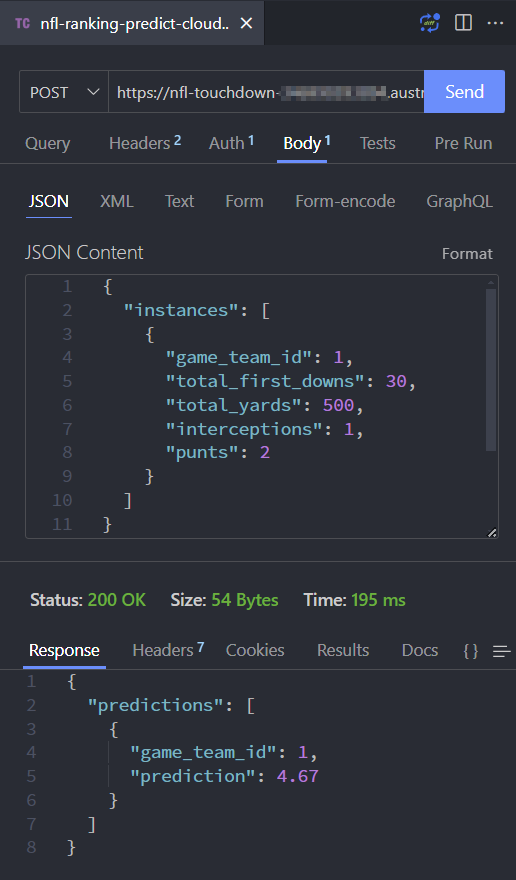
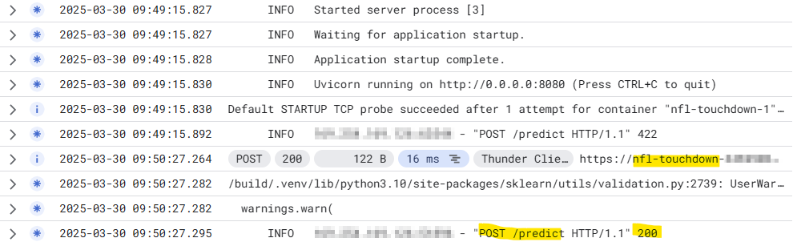

# Deploying ML Models on Cloud Run: From Placeholder to Production

This guide walks through deploying a machine learning model on Google Cloud Run, using a two-phase deployment strategy: placeholder service followed by model deployment.

## Architecture Overview

The architecture connects these components:

1. Vertex AI for training and model registry
2. Model artifacts stored in Cloud Storage
3. Cloud Run service running our prediction container
4. BigQuery for making predictions via remote functions (not discussed in this blog post)

## Prerequisites

I have built this on my Windows development machine with WSL2, VScode and Docker Desktop. The are some of the other requirements on your local development machine.

- Google Cloud Project with required APIs enabled
- Terraform >= 1.0
- Python >= 3.9
- `gcloud` CLI configured

## Phase 1: Placeholder Service

First, we deploy a minimal Nginx container that serves a simple status endpoint. This helps us establish our infrastructure and permissions before deploying the actual model.

### Placeholder Container Structure

Our placeholder service uses Nginx to serve a static JSON response:

```
📁devops/serve/placeholder/
├── Dockerfile
├── nginx.conf
└── status.json
```

```nginx
server {
    listen 8080;
    server_name localhost;

    location / {
        root /usr/share/nginx/html;
        try_files /status.json =404;
        default_type application/json;
    }
}
```

### Initial Deployment

The placeholder is deployed via Terraform:

```hcl
resource "google_cloud_run_service" "cr_nfl_predict" {
  name     = "nfl-touchdown"
  location = var.region

  template {
    spec {
      containers {
        image = "${var.region}-docker.pkg.dev/prj-xyz-shr-rep-0/rpo-bld-dkr-0/placeholder:latest"
        // ...configuration...
      }
    }
  }
}
```

## ModelPorter: A Custom MLOps CLI

ModelPorter is our custom command-line tool that orchestrates the ML model lifecycle across Google Cloud Platform services. It simplifies the complex workflow of training, deploying, and serving machine learning models.

### Why We Built It

Traditional ML deployment often involves juggling multiple cloud services, configuration files, and deployment steps. For our NFL touchdown prediction model, we needed to:

1. Build and push Docker containers for both training and prediction
2. Manage training jobs on Vertex AI
3. Deploy prediction endpoints to Cloud Run
4. Handle environment-specific configurations
5. Maintain consistent model versioning

Rather than managing these steps manually or with complex shell scripts, ModelPorter provides a unified interface.

### Key Features

```bash
# Build containers
modelporter --env=dev nfl.touchdown build --phase=predict

# Train models
modelporter --env=dev nfl.touchdown train --service=vertex

# Deploy prediction service
modelporter --env=dev nfl.touchdown serve --service=cloudrun
```

The CLI handles:

- Environment-specific configuration management
- Container image building and pushing
- Vertex AI training job orchestration
- Cloud Run service updates
- Model artifact management



### Under the Hood

ModelPorter uses several key technologies:

- **Click**: For CLI interface and command structure
- **Hydra**: For configuration management
- **Cloud Build API**: For container image building
- **Vertex AI API**: For model training orchestration
- **Cloud Run API**: For deployment management

Each command in ModelPorter maps to a specific workflow:

1. **Build Command**: Packages model code into containers

```py
# Key environment variables set during build
buildargs = {
    "env": env,
    "project_id": cfg.project_id
}
```

2. **Train Command**: Manages Vertex AI training jobs

```py
# Vertex AI training configuration
job = aiplatform.CustomContainerTrainingJob(
    display_name=f"{display_name}-train-job",
    container_uri=container_uri,
    model_serving_container_image_uri=model_serving_container_image_uri
)
```

3. **Serve Command**: Updates Cloud Run services

```py
# Cloud Run service configuration
service = {
    "template": {
        "containers": [{
            "image": model_serving_container_image_uri,
            "env": [
                {"name": "AIP_STORAGE_URI", "value": model.uri},
                {"name": "AIP_PREDICT_ROUTE", "value": "/predict"}
            ]
        }]
    }
}
```

This abstraction allows our team to focus on model development rather than deployment mechanics, while maintaining consistency across environments.

## Phase 2: Model Training and Deployment

### Training on Vertex AI

Using our custom `modelporter` CLI tool:

```sh
modelporter --env=dev nfl.touchdown train --service=vertex
```

This command:

1. Initiates a training job on Vertex AI
2. Saves the trained model to GCS bucket
3. Registers the model in Vertex AI registry

```sh
No existing model found with display name 'nfl-touchdown'. Creating a new model.
⠴ Training model nfl.touchdown is training on vertex....Training Output directory:
gs://bkt-xyz-dev-nfl-vertex-0/aiplatform-custom-training-2025-02-28-16:29:02.387
⠼ Training model nfl.touchdown is training on vertex....View Training:
https://console.cloud.google.com/ai/platform/locations/australia-southeast1/training/<training-job-id>?project=<project-number>
⠸ Training model nfl.touchdown is training on vertex....CustomContainerTrainingJob projects/<project-number>/locations/australia-southeast1/trainingPipelines/<training-job-id> current state:
PipelineState.PIPELINE_STATE_RUNNING
View backing custom job:
https://console.cloud.google.com/ai/platform/locations/australia-southeast1/training/<id>?project=<project-number>
⠴ Training model nfl.touchdown is training on vertex....CustomContainerTrainingJob projects/<project-number>/locations/australia-southeast1/trainingPipelines/<training-job-id> current state:
PipelineState.PIPELINE_STATE_RUNNING
⠙ Training model nfl.touchdown is training on vertex....CustomContainerTrainingJob run completed. Resource name: projects/<project-number>/locations/australia-southeast1/trainingPipelines/<training-job-id>
⠴ Training model nfl.touchdown is training on vertex....Model available at projects/<project-number>/locations/australia-southeast1/models/<model-id>
```



The Training pipeline results in a registered model in Vertex AI.



As well as the model artifact in storage.



### Deploying the Model Service

Once training is complete, we deploy our FastAPI prediction service:

```bash
modelporter --env=dev nfl.touchdown serve
```

Behind the scenes, `modelporter`:

1. Locates the latest trained model in Vertex AI
2. Updates the Cloud Run service with our prediction container
3. Configures environment variables to point to the model in GCS

```log
Waiting for operation to complete...
Cloud Run service updated. URL: https://nfl-touchdown-<>.a.run.app
```



Once this has finished, if we browse to the Cloud Run service in the web console, and look at the Revisions, we can see a new revision taking 100% of the traffic.

```py
# Key environment variables set during deployment
env = [
    {"name": "AIP_STORAGE_URI", "value": model.uri},
    {"name": "AIP_PREDICT_ROUTE", "value": "/predict"},
    {"name": "PROJECT_ID", "value": project_id}
]
```

## Testing the Deployment

You can verify the deployment first getting an identity token to authenticate to the Cloud Run API:

```sh
# Get an identity token to pass as a bearer
gcloud auth print-identity-token
```

I like to use Thunder Client (The VSCode extension to test constructing API calls).



Thunder Client can also help you generate the programmatic calls in many languages.

```sh
# Make a prediction
curl -X POST \
  'https://nfl-touchdown-<project-id>.<region>.run.app/predict' \
  --header 'Accept: */*' \
  --header 'User-Agent: Thunder Client (https://www.thunderclient.com)' \
  --header 'Authorization: Bearer <identity-token>' \
  --header 'Content-Type: application/json' \
  --data-raw '{"instances":[[23.0, 150.0, 1.0, 20.0]]}'
```

Inspecting the Google Cloud Logs Explorer we can see the service was started and called successfully, confirming the response we got in Thunder Client was indeed returned from the Cloud Run service.



## Infrastructure as Code

All base Cloud infrastructure components are managed via Terraform:

- Cloud Run service configuration
- IAM permissions
- BigQuery connections
- Storage buckets

This ensures consistent deployments across environments and makes it easy to replicate the setup.

```sh
terraform init -backend-config="vars/backend-dev.hcl"
```

```log
Initializing the backend...
Initializing provider plugins...
- Reusing previous version of hashicorp/google from the dependency lock file
- Reusing previous version of hashicorp/random from the dependency lock file
- Using previously-installed hashicorp/google v4.51.0
- Using previously-installed hashicorp/random v3.7.1

Terraform has been successfully initialized!

You may now begin working with Terraform. Try running "terraform plan" to see
any changes that are required for your infrastructure. All Terraform commands
should now work.

If you ever set or change modules or backend configuration for Terraform,
rerun this command to reinitialize your working directory. If you forget, other
commands will detect it and remind you to do so if necessary.
```

The complete solution demonstrates a production-ready ML serving infrastructure that's both scalable and maintainable.
