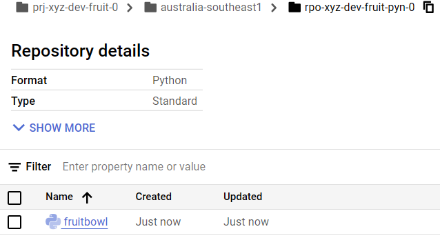

# Publish Fruitbowl as a package to a GCP artifact registry Python package repository

[GCP Python packages via GCPS Artifact Registry](https://medium.com/google-cloud/python-packages-via-gcps-artifact-registry-ce1714f8e7c1#5f79)

```sh
# Update poetry
poetry self update
# Add Google artifact registry keyring to poetry
poetry self add keyrings.google-artifactregistry-auth
# Check the python repository on GCP
gcloud artifacts print-settings python --project=prj-xyz-dev-fruit-0 --repository=rpo-xyz-dev-fruit-pyn-0 --location=australia-southeast1
# Configure a poetry repository to point to the python artifact registry
poetry config repositories.gcp https://australia-southeast1-python.pkg.dev/prj-xyz-dev-fruit-0/rpo-xyz-dev-fruit-pyn-0/
# publish the package to the repository
poetry publish --build --repository gcp
```

```log
Using python3.12 (3.12.3)
Building fruitbowl (0.1.0)
  - Building sdist
  - Built fruitbowl-0.1.0.tar.gz
  - Building wheel
  - Built fruitbowl-0.1.0-py3-none-any.whl

Publishing fruitbowl (0.1.0) to gcp
 - Uploading fruitbowl-0.1.0-py3-none-any.whl 100%
 - Uploading fruitbowl-0.1.0.tar.gz 100%
```


